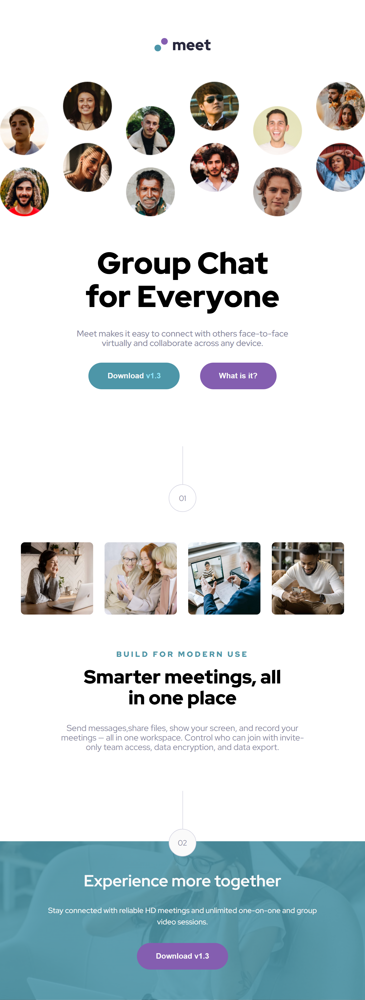
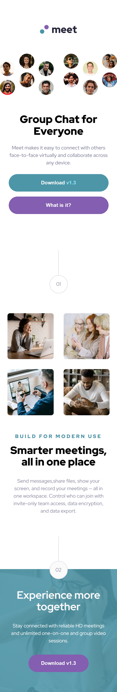

# Frontend Mentor - Meet landing page


## Welcome! 👋

## 🚀 Live Demo & Code  
- **Solution URL:** [Frontend Mentor Solution](https://www.frontendmentor.io/solutions/meet-landing-page-SahNLLgGbo)  
- **Live Site URL:** [GitHub Pages](https://emelinur.github.io/meet-landing-page/)  

---

## 🧰 Built With  

- Semantic **HTML5**  
- **CSS Grid** (main layout)  
- Responsive **media queries**  
- CSS **custom properties (variables)**  
- **Google Fonts** – _Red Hat Display_  

---

## 🧠 What I Learned  

This project helped me strengthen my understanding of **CSS Grid,Flexbox** and how to structure responsive layouts efficiently.

- Using `grid-template-areas` to define named layout regions  
- Applying `grid-template-columns` and `grid-template-rows` to build multi-column layouts  
- Combining Grid + Flexbox helped me divide complex sections more effectively and choose the best layout system for each part of the design.
- In the mobile layout, I learned how to correctly handle layouts where images need to shift left/right by using negative margins, grid-area adjustments, and precise alignment techniques.
- I improved my ability to maintain cross-browser consistency, testing the UI on Chrome, Firefox, and Edge to ensure the layout behaves the same everywhere.
- I strengthened my skill in reading the Figma Inspect panel to extract accurate spacing, typography, width/height, and margin/padding values for pixel-perfect alignment. 

### Resources I Used  

- [W3Schools – CSS Grid](https://www.w3schools.com/css/css_grid.asp)  
- [YouTube Tutorial](https://youtu.be/T01NU_rxjgY?si=Lhxq4U7IML59N4zy)  
- Debugging and guidance with **ChatGPT** 💬  

---

## 📸 Screenshots

| Desktop                          | Tablet                         | Mobile               |
| -------------------------------- | ------------------------------ | -------------------- |
|  |  |  |

_(Replace these with your actual project screenshots)_

---

## 🧩 How to Run Locally  

```bash
# Clone the repository
git clone https://github.com/Emelinur/meet-landing-page.git

# Open the project folder
cd meet-landing-page

# Then open index.html in your browser

